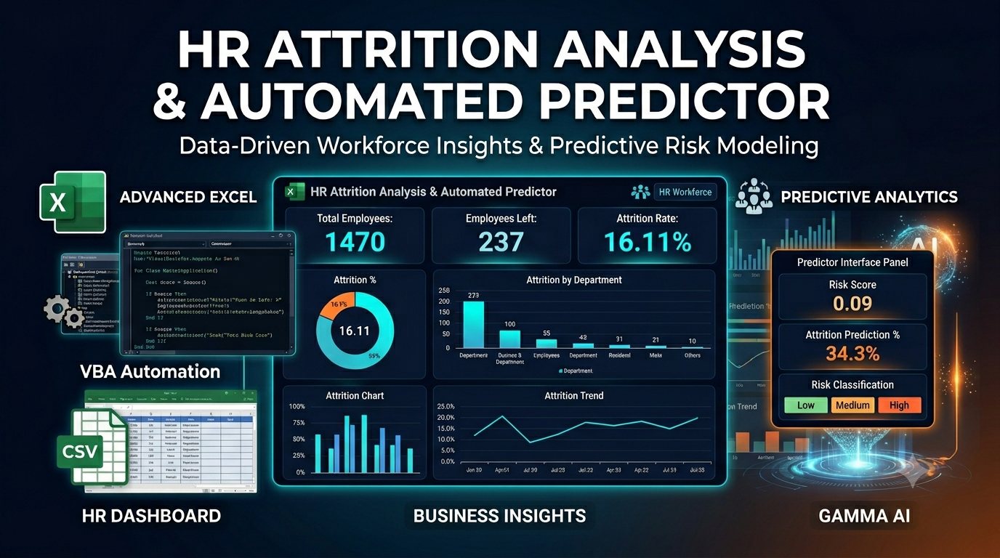

  

# 📌 Project Overview

**Employee attrition** is a major business challenge that impacts productivity, hiring costs, workforce stability, and overall organizational performance. Understanding why employees leave is critical for improving retention and workforce planning.

This project presents an end-to-end HR Attrition Analysis & Automated Predictor built using **Advanced Excel**, **VBA Automation**, and **Data Analytics techniques**. The workbook transforms raw HR employee data into interactive dashboards, actionable business insights, and predictive attrition risk assessment.

The project includes comprehensive workforce analysis across employee demographics, compensation, job satisfaction, work-life balance, overtime, tenure, and managerial factors to identify key drivers of attrition.

Additionally, an **automated predictor model** was developed to estimate employee attrition risk based on 20 critical workforce factors, enabling proactive HR decision-making and retention strategies.

# 🎯 Problem Statement

**"Understanding the Core Business Challenge Behind Employee Attrition"**

Traditional HR reporting methods often fail to provide deeper insights into the real drivers behind employee exits, making it difficult for decision-makers to take timely and data-driven actions.

High attrition often leads to increased recruitment expenses, knowledge loss, reduced team morale, and disruptions in business continuity.

The core challenge is not just tracking attrition, but identifying why employees leave, which workforce segments are most at risk, and how attrition can be proactively reduced through predictive analysis and strategic interventions.

# 🎯 Objectives

**Defining the Key Goals of the Project:-**

- Analyzing employee attrition trends across the organization using HR workforce data.
- Identifying key factors influencing attrition, including demographics, compensation, satisfaction, overtime, and tenure.
- Building interactive dashboards for workforce monitoring and business decision-making.
- Deriving actionable insights to uncover major attrition drivers and high-risk employee segments.
- Developing an automated attrition predictor using scoring logic and VBA automation.
- Enabling proactive HR decision-making through risk classification and predictive analytics.
- Providing data-driven business recommendations to improve employee retention and reduce attrition.
